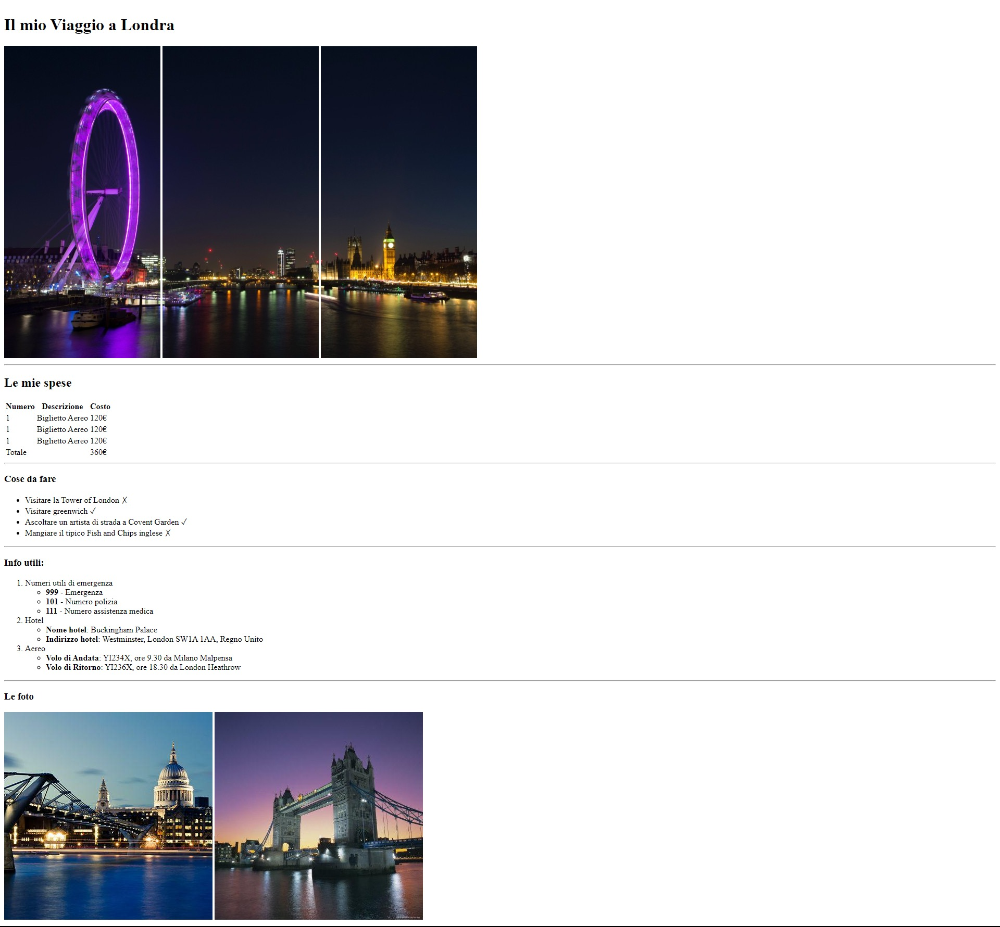

# HTML London Trip

Semantic HTML exercise for a Web Development course.

> Note: See the [Notes](#notes) section in this README for some of the decisions I made while writing the HTML markup, and the reasoning behind them.
>
> Tip: Additional enhancements (CSS & JS) are available in the `feat/with-css-and-js` branch (documentation still in progress).

## Live Demo

- [View the live webpage](https://emanuelefavero.github.io/html-london-trip/)

## Goal

Recreate a provided webpage using only HTML, with focus on semantic structure, readable markup, and accessibility fundamentals.

## Constraints

- HTML only
- No CSS
- No JavaScript
- No frameworks or dependencies

## Project Structure

```text
├── .prettierrc
├── index.html
├── README.md
├── assets/
│   ├── source-layout.jpg
│   └── WEB-IMAGES.md
└── img/
    ├── pexels-bill-emrich-230794-0.jpg
    ├── pexels-bill-emrich-230794-1.jpg
    └── pexels-bill-emrich-230794-2.jpg
```

- `index.html`: The main HTML file containing the webpage markup.
- `README.md`: This file, providing an overview of the project, goals, constraints, and notes.
- `assets/`: Contains the reference screenshot and a markdown file listing the web images used in the project.
- `img/`: Contains the local images used in the webpage.

> Note: I have also added a `.prettierrc` with my preferred formatting settings to ensure consistent indentation and readability in the `index.html` file.

## What This Project Shows

- correct HTML document structure
- use of semantic sections and headings
- proper use of lists, tables, images, and text elements
- simple accessible markup with logical reading order

## Notes

- I decided against using `footer`, as the final photo block is still part of the main page content, not closing or supplementary page information.
- I chose not to use `figure` for the images because the default browser margins changed the layout and made it less faithful to the reference screenshot, as we cannot use CSS in this exercise.
- Considered adding `id` attributes (e.g., for the total in the expenses table) to support potential future scripting, but omitted them to keep the markup minimal and aligned with the current project scope.
- I decided against using `h3` for headings after "Le mie Spese", such as "Cose da fare" etc., because though those appear smaller, semantically they are not subsections of "Le mie Spese", but rather separate sections of the page. Using `h2` for all main sections maintains a clear and logical heading structure.

## Reference Screenshot



&nbsp;

---

&nbsp;

[**Go To Top &nbsp; ⬆️**](#html-london-trip)
