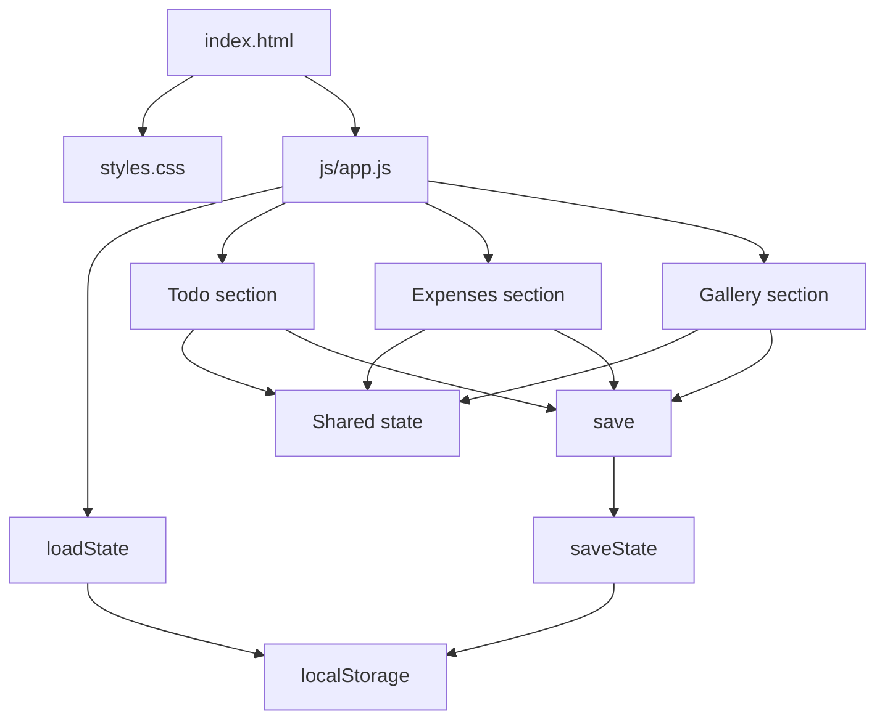
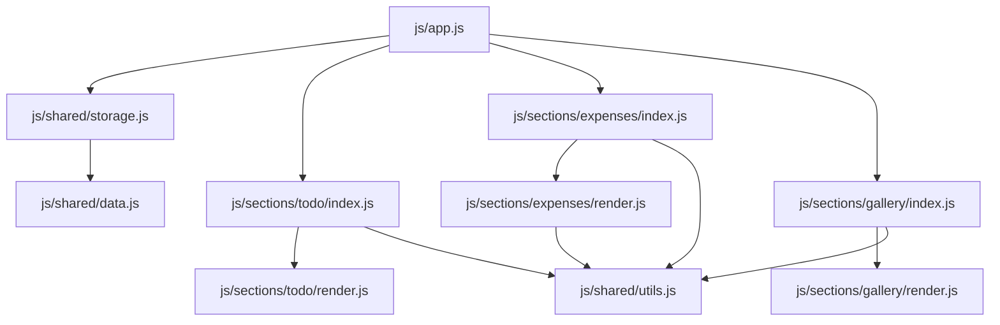

# Frontend Architecture

This project uses a small modular pattern: `index.html` provides the structure, `js/app.js` bootstraps the page, and each interactive section owns its DOM events and rendering logic.

## Runtime Flow

## JavaScript Module Structure

## State Model

The shared state object contains three top-level arrays:

- `todoItems`
- `expenses`
- `photos`

Initial values come from `js/shared/data.js`. `js/shared/storage.js` clones those defaults and uses them as a fallback when saved data is missing or invalid.

## Section Pattern

Each interactive section follows the same split:

- `index.js`: finds DOM nodes, binds events, updates state, and triggers persistence
- `render.js`: rebuilds the section UI from the current state

This keeps the bootstrap simple and makes each section independent while still sharing one persisted state object.
