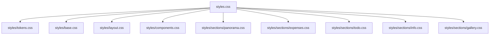

# Styles And Behavior

The project keeps styling and interactivity intentionally lightweight. CSS is organized by layer and responsibility, while JavaScript updates the DOM by rerendering each interactive section from state.

## Stylesheet Organization

## CSS Responsibilities

- `tokens.css`: design tokens such as colors, spacing, radius, typography, and motion values
- `base.css`: element defaults for typography, form controls, buttons, and images
- `layout.css`: page width, spacing, section rhythm, and separators
- `components.css`: reusable UI patterns, mainly shared form layout classes
- `styles/sections/*.css`: section-specific presentation and responsive adjustments

The root `styles.css` file defines the cascade layer order, which makes the override strategy explicit and keeps section styles predictable.

## Interactive Behavior

### Expenses

- reads and renders the expense list into the existing table body
- adds new expenses from the form
- removes expenses from row action buttons
- recalculates the total after each change

### Todo

- renders todo items as interactive rows
- adds new items from the form
- toggles completion state from row clicks or checkbox changes
- removes items with a dedicated action button

### Gallery

- renders photo cards from the photo list
- adds new photos from the form
- removes photos from card action buttons
- applies a fallback alt text when the submitted description is empty

## Rendering Strategy

After each valid state change, the section:

1. updates the shared in-memory state
2. saves the full state to `localStorage`
3. rebuilds the affected section DOM from the latest state

This approach stays easy to follow and is appropriate for the size of the project.
